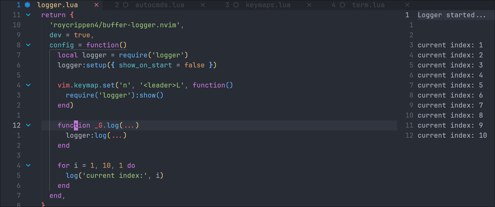

# buffer-logger.nvim

**buffer-logger.nvim** is a simple lua logger for Neovim.



## Feature

This plugin aims to do one thing and one thing only, make logging in lua easy.

buffer-logger.nvim simply opens a new vertical split and any log statements made using it will appear in the buffer. That's it.

## Installation

```lua
-- lazy.nvim
{

}
```
